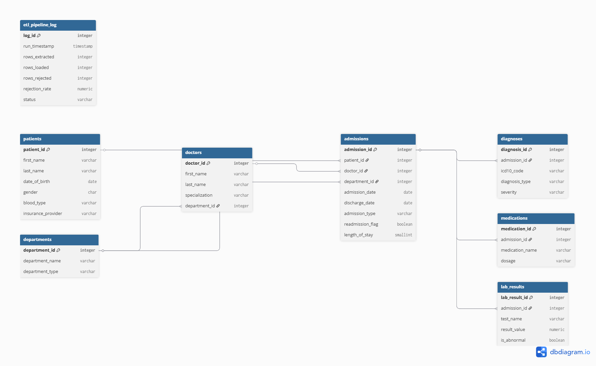
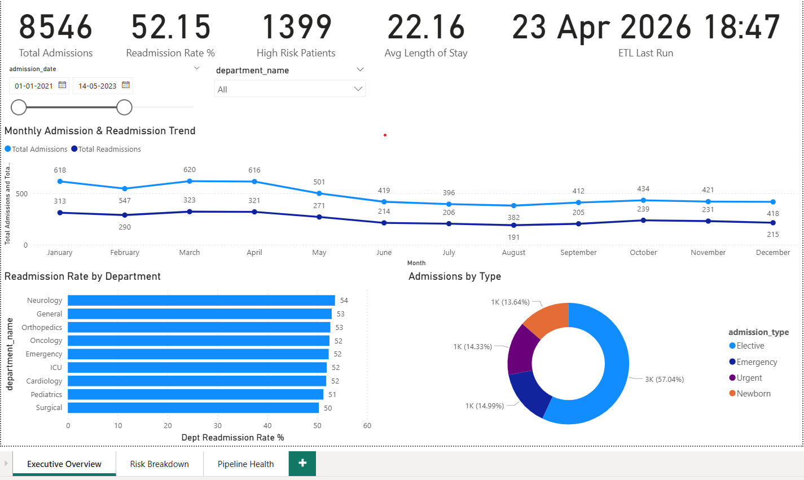
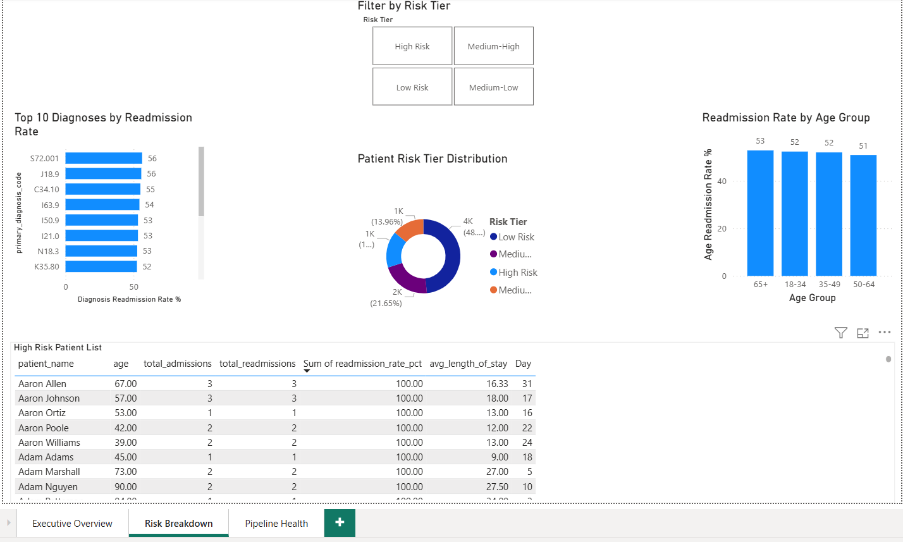
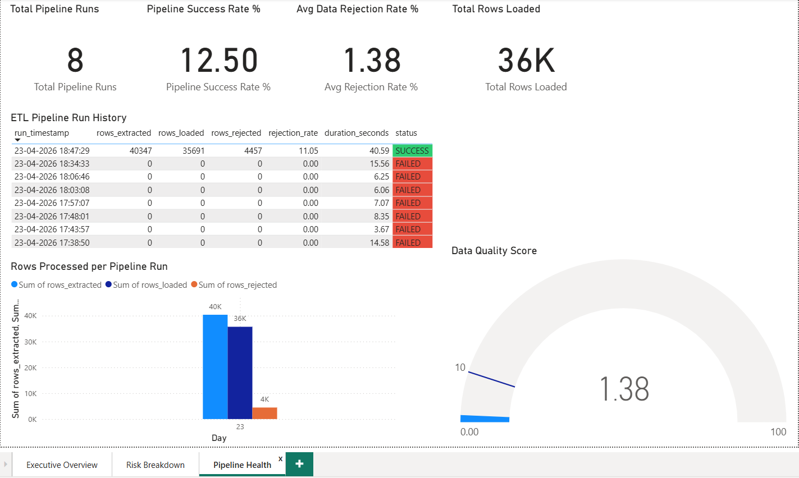

# Patient-readmission-risk-analyzer
### End-to-End Healthcare Analytics Platform

## Project Overview

A production-grade healthcare analytics platform that analyzes
patient readmission risk across a synthetic hospital dataset of
**40,347 raw records** across 3 source systems. The platform
features a full Python ETL pipeline, a normalized PostgreSQL
data warehouse, 20 advanced SQL analytics queries, an
exploratory data analysis notebook, and a 3-page Power BI
executive dashboard.

**Business Problem:** Hospital readmissions within 30 days are
a critical metric tracked by CMS (Centers for Medicare &
Medicaid Services). Hospitals above the national benchmark face
financial penalties. This platform identifies high-risk patients,
surfacing actionable insights for hospital leadership to reduce
readmission rates and optimize resource allocation.

---

## Architecture

```
Raw Source Files          ETL Pipeline            PostgreSQL
(CSV + JSON)    ──────►  Extract          ──────► Staging Schema
                          Transform                    │
patients_raw.csv          Load            ──────► Production Schema
admissions_raw.csv        Logging                      │
lab_results_raw.json                                   │
                                               ┌───────┴────────┐
                                               │                │
                                         SQL Analytics     Power BI
                                         (20 queries)    Dashboard
                                               │                │
                                         Python EDA       3 Pages
                                         Notebook         15+ Visuals
```

---

## Tech Stack

| Layer | Technology | Purpose |
|---|---|---|
| Database | PostgreSQL 16 | Data warehouse — staging + production schemas |
| ETL Pipeline | Python 3.10 | Extract, transform, load pipeline |
| Data manipulation | pandas, SQLAlchemy | Data cleaning and DB connection |
| Data generation | Faker | Synthetic realistic patient data |
| Analytics | SQL (CTEs, window functions, stored procedures) | 20 analytics queries |
| EDA | Jupyter Notebook, matplotlib, seaborn | Exploratory analysis + visualizations |
| Dashboard | Power BI Desktop | 3-page executive dashboard |
| Version control | Git + GitHub | Full project version history |

---

## Key Results

| Metric | Value |
|---|---|
| Raw records processed | 40,347 |
| Records loaded to production | 35,691 |
| Data rejection rate | 11.05% |
| Total patients | 3,749 |
| Total admissions | 8,546 |
| Overall readmission rate | 52.15% |
| High risk patients identified | 1,399 |
| Avg length of stay | 22.16 days |
| ETL pipeline duration | 40.59 seconds |

---

## Project Structure

```
patient-readmission-risk-analyzer/
│
├── sql/
│   ├── 01_create_schemas.sql         # Create staging + production schemas
│   ├── 02_production_tables.sql      # 8 production tables with constraints
│   ├── 03_staging_tables.sql         # 3 staging tables (raw data landing)
│   ├── 04_indexes.sql                # Performance indexes
│   ├── 05_views.sql                  # 3 analytical views
│   ├── 06_alter_fixes.sql            # Schema fixes applied during ETL dev
│   └── 07_analytics_queries.sql      # 20 analytics queries
│
├── etl/
│   ├── generate_raw_data.py          # Synthetic messy raw data generator
│   └── etl_pipeline.py               # Full ETL pipeline (extract/transform/load)
│
├── data/
│   ├── raw/                          # Raw source files (never modified)
│   │   ├── patients_raw.csv
│   │   ├── admissions_raw.csv
│   │   └── lab_results_raw.json
│   └── processed/                    # Cleaned output files
│
├── notebooks/
│   └── eda_analysis.ipynb            # EDA notebook with 8 visualizations
│
├── dashboard/
│   ├── patient_readmission_dashboard.pbix
│   ├── page1_executive_overview.png
│   ├── page2_risk_breakdown.png
│   └── page3_pipeline_health.png
│
├── docs/
│   └── erd_diagram.png               # Entity relationship diagram
│
├── logs/                             # ETL pipeline run logs
├── .env.example                      # Environment variables template
├── .gitignore
└── README.md
```

---

## Database Schema

The database uses a **staging → production** pattern with two
separate schemas:

- **Staging schema** — raw unvalidated data lands here first.
  No constraints, accepts everything including dirty data.
- **Production schema** — clean, validated, analytics-ready data.
  Full constraints, foreign keys, indexes.

### Production Tables (8)

```
patients          — Core patient demographics
admissions        — Every hospital admission (central fact table)
diagnoses         — ICD-10 diagnosis codes per admission
medications       — Medications prescribed per admission
lab_results       — Lab test results per admission
doctors           — Doctor details and specializations
departments       — Hospital department lookup table
etl_pipeline_log  — ETL pipeline audit trail
```

### Entity Relationship Diagram

---

## ETL Pipeline

The Python ETL pipeline processes raw data through 4 stages:

### Stage 1 — Extract
- Reads CSV and JSON source files
- Normalizes column names to lowercase
- Loads raw data into PostgreSQL staging tables

### Stage 2 — Transform
Data quality issues handled:

| Issue | Fix applied |
|---|---|
| 7 mixed date formats | Standardized to ISO 8601 (YYYY-MM-DD) |
| Inconsistent gender values (Male/male/m) | Normalized to M/F/O |
| ~3% duplicate patients | Deduplicated on name + DOB |
| ~8% invalid ICD-10 codes | Validated with regex, rejected to log |
| Missing discharge dates | Handled as NULL, not dropped |
| Discharge before admission | Fixed — discharge set to NULL |
| True/False/1/0/YES/NO booleans | Normalized to PostgreSQL boolean |
| Non-numeric lab values (PENDING, >999) | Flagged as abnormal, not crashed |
| Unparseable reference ranges | Extracted min/max or set NULL |

### Stage 3 — Load
- UPSERT pattern (INSERT ... ON CONFLICT DO NOTHING)
- Loads in correct dependency order (departments → doctors → patients → admissions → lab results)
- Lab results loaded in batches of 500 for performance
- Full transaction wrapping — rollback on any failure

### Stage 4 — Logging
Every pipeline run writes to `production.etl_pipeline_log`:
```
run_timestamp, rows_extracted, rows_transformed,
rows_loaded, rows_rejected, rejection_rate,
duration_seconds, status, error_message
```

### Run the pipeline
```bash
# Activate virtual environment
venv\Scripts\activate

# Generate raw source data
python etl/generate_raw_data.py

# Run the ETL pipeline
python etl/etl_pipeline.py
```

Expected output:
```
STAGE 1 — EXTRACT     ✓  40,347 rows extracted
STAGE 2 — TRANSFORM   ✓  35,691 rows accepted | 4,457 rejected
STAGE 3 — LOAD        ✓  35,691 rows loaded
Status: SUCCESS | Duration: 40.59s | Rejection rate: 11.05%
```

---

## SQL Analytics Queries

20 queries demonstrating full SQL depth across 7 categories:

| Category | Queries | SQL Techniques |
|---|---|---|
| Foundational | 1-4 | Aggregations, JOINs, GROUP BY, HAVING |
| CTEs & Subqueries | 5-8 | CTEs, self-joins, date arithmetic |
| Window Functions | 9-12 | RANK(), LAG(), NTILE(), running totals |
| Cohort Analysis | 13-14 | Cohort patterns, DATE_TRUNC |
| Lab Results | 15-16 | Correlation analysis, abnormal flagging |
| ETL Audit | 17-18 | Pipeline health queries |
| Stored Procedures | 19-20 | Stored procedure, executive summary CTE |

### Signature query — 30-day readmission flagging
```sql
WITH admission_pairs AS (
    SELECT
        a1.patient_id,
        a1.admission_id                          AS first_admission_id,
        a1.admission_date                        AS first_admission_date,
        a1.discharge_date,
        a2.admission_id                          AS readmission_id,
        a2.admission_date                        AS readmission_date,
        (a2.admission_date - a1.discharge_date)  AS days_between
    FROM production.admissions a1
    JOIN production.admissions a2
        ON  a1.patient_id    = a2.patient_id
        AND a2.admission_date > a1.admission_date
        AND a1.discharge_date IS NOT NULL
)
SELECT
    p.patient_id,
    p.first_name || ' ' || p.last_name          AS patient_name,
    ap.first_admission_date,
    ap.discharge_date,
    ap.readmission_date,
    ap.days_between
FROM admission_pairs ap
JOIN production.patients p ON ap.patient_id = p.patient_id
WHERE ap.days_between <= 30
  AND ap.days_between >= 0
ORDER BY ap.days_between ASC;
```

---

## Power BI Dashboard

3-page executive dashboard connected live to PostgreSQL:

### Page 1 — Executive Overview
- 5 KPI cards (Total Admissions, Readmission Rate, High Risk
  Patients, Avg Length of Stay, ETL Last Run)
- Monthly admission & readmission trend line chart
- Readmission rate by department bar chart
- Admissions by type donut chart
- Interactive date range and department slicers

### Page 2 — Risk Breakdown
- Top 10 diagnoses by readmission rate
- Readmission rate by age group
- Patient risk tier distribution donut chart
- High risk patient drill-through table
- Risk tier filter slicer

### Page 3 — Pipeline Health *(unique to this project)*
- ETL run history table with conditional formatting
  (SUCCESS = green, FAILED = red)
- Rows processed per pipeline run bar chart
- Data quality score gauge
- Pipeline KPI cards

### Dashboard Screenshots

**Page 1 — Executive Overview**


**Page 2 — Risk Breakdown**


**Page 3 — Pipeline Health**


---

## Key Business Insights

1. **Overall readmission rate is 52.15%** — significantly above
   the CMS national benchmark of ~15%, indicating a critical need
   for targeted intervention strategies

2. **Neurology department has the highest readmission rate** —
   discharge protocols and post-discharge follow-up need urgent
   review in this department

3. **Age is not the dominant risk factor** — patients aged 65+
   were readmitted at 52% vs 51% for under 65, suggesting
   diagnosis severity and department are stronger predictors

4. **High abnormal lab results correlate with readmissions** —
   patients with >50% abnormal lab results showed higher
   readmission rates, suggesting lab monitoring should inform
   discharge decisions

5. **11% data rejection rate** — primarily from invalid ICD-10
   codes and inconsistent date formats across source systems,
   highlighting the need for standardized data entry protocols

---

## How to Run This Project

### Prerequisites
```
PostgreSQL 16
Python 3.10+
Power BI Desktop
```

### Setup
```bash
# 1. Clone the repository
git clone https://github.com/GahanaNagaraja/patient-readmission-risk-analyzer.git
cd patient-readmission-risk-analyzer

# 2. Create and activate virtual environment
python -m venv venv
venv\Scripts\activate

# 3. Install dependencies
pip install pandas psycopg2-binary sqlalchemy faker matplotlib seaborn jupyter openpyxl python-dotenv

# 4. Create .env file with your PostgreSQL credentials
# Copy .env.example to .env and fill in your details
```

### Create .env file
```
DB_HOST=localhost
DB_PORT=5432
DB_NAME=patient_readmission_db
DB_USER=postgres
DB_PASSWORD=your_password_here
```

### Run the project
```bash
# Step 1 — Set up database schema (run in pgAdmin)
# Execute sql/01 through sql/07 in order

# Step 2 — Generate raw data
python etl/generate_raw_data.py

# Step 3 — Run ETL pipeline
python etl/etl_pipeline.py

# Step 4 — Launch EDA notebook
jupyter notebook notebooks/eda_analysis.ipynb

# Step 5 — Open Power BI dashboard
# Open dashboard/patient_readmission_dashboard.pbix
# Connect to your local PostgreSQL instance
```


---

## Author

**Gahana Nagaraja**
- GitHub: [GahanaNagaraja](https://github.com/GahanaNagaraja)

---

*Built as a portfolio project to demonstrate end-to-end data
analytics engineering skills across SQL, Python, ETL, and
Business Intelligence.*